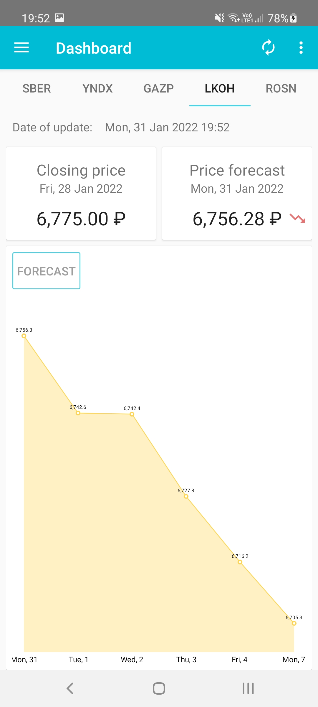
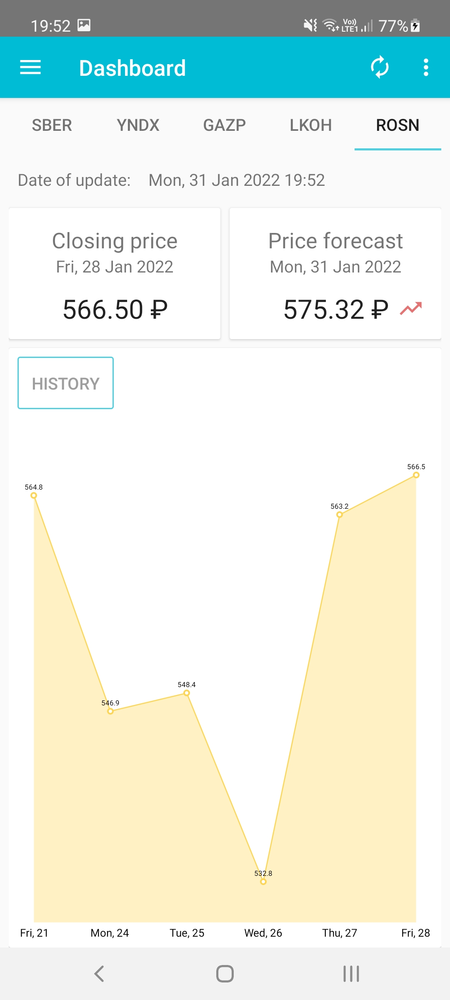

# Predictor experimental app for prediction stock price

In this app you'll find:
*   Local prediction with TensorFlow Lite **[LiteRT](https://ai.google.dev/edge/litert/android)** 
*   Save data in a local database using Room **[ROOM](https://developer.android.com/training/data-storage/room)**.
*   Dependency injection with Hilt **[Hilt](https://developer.android.com/training/dependency-injection/hilt-android)**
*   Kotlin coroutins for asynchronous operations **[coroutines](https://kotlinlang.org/docs/coroutines-overview.html)**

## Screenshots

*   You can install this app: **[Predictor](https://play.google.com/store/apps/details?id=com.gribanskij.predictor&hl=en&pli=1)**

